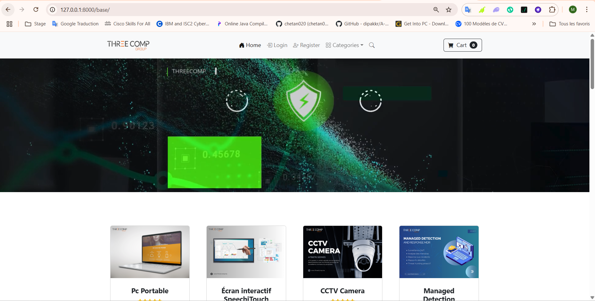
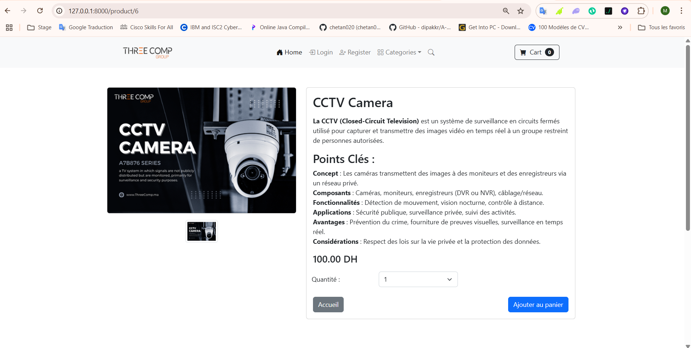

# 🛒 E-Commerce Platform - ThreeComp Company

Une plateforme e-commerce moderne et complète développée avec Django, offrant une expérience d'achat fluide avec gestion des produits, panier d'achat, système de paiement PayPal et interface d'administration avancée.

## 📋 Table des matières

- [🚀 Fonctionnalités](#-fonctionnalités)
- [🛠️ Technologies utilisées](#️-technologies-utilisées)
- [📦 Installation](#-installation)
- [⚙️ Configuration](#️-configuration)
- [🎯 Utilisation](#-utilisation)
- [📱 Captures d'écran](#-captures-décran)
- [🏗️ Architecture](#️-architecture)
- [🔧 API Endpoints](#-api-endpoints)
- [📊 Base de données](#-base-de-données)
- [🔒 Sécurité](#-sécurité)
- [🚀 Déploiement](#-déploiement)
- [🤝 Contribution](#-contribution)
- [📄 Licence](#-licence)

## 🚀 Fonctionnalités

### 👥 Gestion des utilisateurs
- **Inscription/Connexion** : Système d'authentification complet
- **Profils utilisateurs** : Gestion des informations personnelles et adresses de livraison
- **Sécurité** : Validation des mots de passe et protection CSRF

### 🛍️ Catalogue de produits
- **Catégories** : Organisation des produits par catégories
- **Recherche avancée** : Recherche par nom, description et catégorie
- **Images multiples** : Support jusqu'à 4 images par produit
- **Gestion des stocks** : Statuts de disponibilité (Disponible, Rupture, En solde)
- **Prix de solde** : Système de réductions intégré

### 🛒 Système de panier
- **Panier persistant** : Sauvegarde automatique pour les utilisateurs connectés
- **Gestion des quantités** : Modification et suppression d'articles
- **Calcul automatique** : Totaux avec gestion des soldes
- **Session sécurisée** : Panier sauvegardé en base de données

### 💳 Paiement et commandes
- **Intégration PayPal** : Paiement sécurisé via PayPal Sandbox
- **Gestion des commandes** : Suivi complet du cycle de vie
- **Adresses de livraison** : Gestion des adresses multiples
- **Statuts de commande** : Suivi des expéditions

### 🎨 Interface utilisateur
- **Design responsive** : Compatible mobile, tablette et desktop
- **Templates Django** : Interface moderne et intuitive
- **Messages flash** : Notifications utilisateur en temps réel
- **Navigation intuitive** : Menu et breadcrumbs optimisés

### 🔧 Administration
- **Interface Django Admin** : Gestion complète des données
- **TinyMCE** : Éditeur riche pour les descriptions de produits
- **Gestion des médias** : Upload et organisation des images
- **Statistiques** : Tableaux de bord intégrés

## 🛠️ Technologies utilisées

### Backend
- **Django 5.2.1** : Framework web Python
- **SQLite/PostgreSQL** : Base de données
- **Django Admin** : Interface d'administration
- **Django Sessions** : Gestion des sessions utilisateur

### Frontend
- **HTML5/CSS3** : Structure et style
- **JavaScript** : Interactivité client
- **Bootstrap** : Framework CSS responsive
- **FontAwesome** : Icônes modernes

### Paiement
- **PayPal SDK** : Intégration paiement sécurisé
- **Django PayPal** : Module Django pour PayPal

### Déploiement
- **Railway** : Plateforme de déploiement
- **WhiteNoise** : Gestion des fichiers statiques
- **Procfile** : Configuration de déploiement

### Outils de développement
- **Python 3.x** : Langage principal
- **pip** : Gestionnaire de paquets
- **Git** : Contrôle de version
- **Virtual Environment** : Isolation des dépendances

## 📦 Installation

### Prérequis
```bash
# Python 3.8 ou supérieur
python --version

# pip (gestionnaire de paquets Python)
pip --version

# Git (contrôle de version)
git --version
```

### Clonage du projet
```bash
# Cloner le repository
git clone https://github.com/votre-username/ecommerce-django.git
cd ecommerce-django
code .
```

### Configuration de l'environnement virtuel
```bash
# Créer un environnement virtuel
python -m venv env

# Activer l'environnement virtuel
# Windows
env\Scripts\activate
# macOS/Linux
source env/bin/activate
```

### Installation des dépendances
```bash
# Installer les dépendances
pip install -r requirements.txt
```

### Configuration de la base de données
```bash
# Appliquer les migrations
python manage.py makemigrations
python manage.py migrate

# Créer un superutilisateur
python manage.py createsuperuser
```

### Lancement du serveur
```bash
# Démarrer le serveur de développement
python manage.py runserver

# Accéder à l'application
# http://127.0.0.1:8000/
```

## ⚙️ Configuration

### Variables d'environnement
Créer un fichier `.env` à la racine du projet :

```env
# Django Settings
SECRET_KEY=votre-clé-secrète-django
DEBUG=True
ALLOWED_HOSTS=localhost,127.0.0.1

# Database (optionnel pour PostgreSQL)
DB_ENGINE=django.db.backends.postgresql
DB_NAME=your_db_name
DB_USER=your_db_user
DB_PASSWORD=your_db_password
DB_HOST=localhost
DB_PORT=5432

# PayPal Settings
PAYPAL_TEST=True
PAYPAL_RECEIVER_EMAIL=business@threecomp.com
```

### Configuration PayPal
1. Créer un compte PayPal Developer
2. Configurer les clés API dans les paramètres
3. Activer le mode sandbox pour les tests

## 🎯 Utilisation

### Pour les administrateurs
1. **Accès admin** : `http://127.0.0.1:8000/admin/`
2. **Gestion des produits** : Ajout, modification, suppression
3. **Gestion des commandes** : Suivi et mise à jour des statuts
4. **Gestion des utilisateurs** : Administration des comptes

### Pour les clients
1. **Parcourir les produits** : Navigation par catégories
2. **Recherche** : Trouver rapidement les produits
3. **Ajouter au panier** : Sélection des quantités
4. **Finaliser l'achat** : Paiement sécurisé via PayPal

## 📱 Captures d'écran

## 📸 Aperçu du Projet – ThreeComp SECURITY

Ce projet est une plateforme e-commerce spécialisée dans les solutions de sécurité informatique et matérielle, développée avec Django.

---

### 🏠 Page d'accueil – ThreeComp SECURITY


> Page principale de présentation du groupe ThreeComp, avec un message de bienvenue et un accès rapide au matériel disponible.

---

### 💡 Nos Solutions – Optimisez votre stratégie numérique


> Cette section met en avant les solutions proposées par l’entreprise : cybersécurité, IA et Data Science.

---

### 🛒 Page Boutique – Produits disponibles



> Présentation dynamique des différents produits proposés, comme des PC portables, caméras de surveillance, écrans interactifs, etc.

---

### 🔍 Détail Produit – CCTV Camera



> Page de détail pour un produit spécifique (CCTV Camera), incluant description, spécifications techniques, prix et ajout au panier.

---


## 🏗️ Architecture

### Structure du projet
```
ecommerce-django/
├── APP_Web/                 # Configuration principale Django
│   ├── settings.py          # Paramètres de l'application
│   ├── urls.py             # URLs principales
│   └── wsgi.py             # Configuration WSGI
├── Ecommerce_Website/       # Application principale e-commerce
│   ├── models.py           # Modèles de données
│   ├── views.py            # Logique métier
│   ├── urls.py             # URLs de l'application
│   └── forms.py            # Formulaires personnalisés
├── cart/                   # Application panier d'achat
│   ├── cart.py             # Logique du panier
│   └── views.py            # Vues du panier
├── payment/                # Application paiement
│   ├── models.py           # Modèles de commande
│   ├── views.py            # Logique de paiement
│   └── forms.py            # Formulaires de livraison
├── Templates/              # Templates HTML
│   └── Ecom/              # Templates e-commerce
├── static/                 # Fichiers statiques
│   ├── css/               # Styles CSS
│   ├── js/                # Scripts JavaScript
│   └── img/               # Images et médias
└── media/                 # Fichiers uploadés
```

### Modèles de données
- **User** : Utilisateurs Django standard
- **Profile** : Informations utilisateur étendues
- **Categories** : Catégories de produits
- **Produit** : Produits avec images multiples
- **Order** : Commandes clients
- **OrderItem** : Articles de commande
- **ShippingAddress** : Adresses de livraison


## 📊 Base de données

### Schéma principal
```sql
-- Utilisateurs et profils
User (Django standard)
├── Profile (informations étendues)
└── ShippingAddress (adresses de livraison)

-- Produits et catégories
Categories
└── Produit (produits avec images multiples)

-- Commandes
Order (commandes principales)
└── OrderItem (articles de commande)
```

### Relations clés
- **User ↔ Profile** : OneToOne
- **User ↔ ShippingAddress** : OneToOne
- **Categories ↔ Produit** : OneToMany
- **Order ↔ OrderItem** : OneToMany
- **User ↔ Order** : OneToMany

## 🔒 Sécurité

### Authentification
- **Django Auth** : Système d'authentification robuste
- **Validation des mots de passe** : Règles de sécurité
- **Protection CSRF** : Protection contre les attaques CSRF
- **Sessions sécurisées** : Gestion sécurisée des sessions

### Paiement
- **PayPal Sandbox** : Environnement de test sécurisé
- **Validation des données** : Vérification des entrées
- **Chiffrement SSL** : Communication sécurisée

### Données
- **Validation des formulaires** : Contrôle des entrées
- **Échappement HTML** : Protection XSS
- **Permissions** : Contrôle d'accès granulaire

## 🚀 Déploiement

### Configuration Railway
```bash
# Variables d'environnement Railway
SECRET_KEY=votre-clé-secrète-production
DEBUG=False
ALLOWED_HOSTS=votre-domaine.railway.app
DATABASE_URL=postgresql://...
```

### Commandes de déploiement
```bash
# Collecter les fichiers statiques
python manage.py collectstatic

# Appliquer les migrations
python manage.py migrate

# Créer le superutilisateur
python manage.py createsuperuser
```


## 📄 Licence

Ce projet est sous licence MIT. Voir le fichier `LICENSE` pour plus de détails.

---

## 📞 Contact

**ThreeComp Company**
- **Email** : [azzam.moo@gmail.com](mailto:azzam.moo@gmail.com)
- **GitHub** : [@azzammoo10](https://github.com/azzammoo10)

---

**Développé avec ❤️ par AZZAM Mohamed **